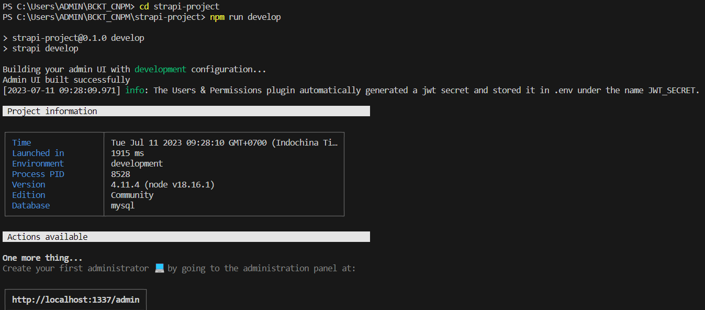

# Hướng dẫn chung:
- [Yêu cầu chung](#yêu-cầu)
- [Cài đặt trên localhost](#cài-đặt-trên-localhost)
- [Dockerize ứng dụng](#dockerize-ứng-dụng)

## Yêu cầu chung:
Đối với cách triển khai này, chúng ta sử dụng:
- Node.js phiên bản 18.16.1.
- Trình quản lý gói Node.js là npm đi kèm có phiên bản 9.7.2.
- Cơ sở dữ liệu là MySQL phiên bản 8.0.
- Nếu có thêm dockerize ứng dụng thì cài thêm Docker Desktop.
- Trình soạn thảo, ở đây ta dùng trình soạn thảo Visual Studio Code.

## Cài đặt trên localhost:
**Bước 1:** Mở terminal của Visual Studio Code lên, chạy câu lệnh:
```bash
npx create-strapi-app@latest strapi-project
```
Với:
- `npx`: chạy lệnh từ gói npm.
- `create-strapi-app`: là gói Strapi.
- `@latest`: chỉ ra rằng phiên bản mới nhất của Strapi được sử dụng.
- `strapi-project`: là tên của dự án Strapi của bạn.

**Bước 2:** Xuất hiện thông báo, gõ `y`, nhấn Enter.
  

**Bước 3:** Thiết lập:
- Chọn "Custom (manual settings)"  
  
- Chọn "JavaScript"  
  
- Chọn "mysql"  
  
- Đặt tên cho cơ sở dữ liệu và thiết lập các thông số cho cơ sở dữ liệu  
  
  
- Màn hình hiện ra sau khi thiết lập  
  

**Bước 4:** Cài đặt gói MySQL (tải tại [đây](https://dev.mysql.com/downloads/file/?id=518835)) và thiết lập cấu hình cơ sở dữ liệu  
Tất cả để giá trị mặc định ngoại trừ các thông số sau:  
-	Authentication Method: chọn "Use Legacy Authentication Method"  
  
- Accounts and Roles: mật khẩu tài khoản root nhập tùy ý; sau đó chọn "Add User" -> nhập username là userStrapi, mật khẩu là user123  
  

**Bước 5:** Kết nối cơ sở dữ liệu  
Mở MySQL Workbench, nhấn vào dấu (+) để tạo kết nối mới  
  
Nhập hostname là 127.0.0.1, username là userStrapi, port là 3306, connection name đặt tên tùy ý  
Chọn "Test Connection" và nhập mật khẩu là user123  
  
Cửa sổ hiện ra gõ và chạy lệnh `create database dbStrapi` để tạo cơ sở dữ liệu dbStrapi  
  

**Bước 6:** Quay lại cửa sổ dòng lệnh của Visual Studio Code, và nhập lần lượt các câu lệnh:
```bash
cd strapi-project
npm run develop
```
  
Kết quả  
  

**Bước 7:** Truy cập ứng dụng theo đường dẫn http://localhost:1337/, thực hiện tạo tài khoản và đăng nhập vào ứng dụng.

## Dockerize ứng dụng:
*Ở phần này, chúng ta thực hiện dockerize ứng dụng đã có sẵn bằng cài đặt trên localhost. Nếu chưa có ứng dụng, thực hiện cài đặt mới ứng dụng tại [đây](#cài-đặt-trên-localhost)*

**Bước 1:** Mở Docker Desktop lên để khởi động dịch vụ.

**Bước 2:** Trong terminal của Visual Studio Code, pull image của MySQL về theo câu lệnh:
```bash
docker pull mysql:latest
```
**Bước 3:** Vào thư mục chứa mã nguồn dự án Strapi (ở đây tên là `strapi-project`), tạo mới các file với mã nguồn như sau:
- Dockerfile:
```Dockerfile
FROM node:16
ARG NODE_ENV=development
ENV NODE_ENV=${NODE_ENV}
WORKDIR /opt/
COPY ./package.json ./package-lock.json ./
ENV PATH /opt/node_modules/.bin:$PATH
RUN npm install
WORKDIR /opt/app
COPY ./ .
RUN npm run build
EXPOSE 1337
CMD ["npm", "run", "develop"]
```
- Docker-compose.yml:
```yaml
version: "3"
services:
  strapi:
    container_name: strapi-container
    build: .
    image: strapi-image
    restart: unless-stopped
    env_file: .env
    environment:
      DATABASE_CLIENT: ${DATABASE_CLIENT}
      DATABASE_HOST: strapiDB
      DATABASE_NAME: ${DATABASE_NAME}
      DATABASE_USERNAME: ${DATABASE_USERNAME}
      DATABASE_PORT: ${DATABASE_PORT}
      JWT_SECRET: ${JWT_SECRET}
      ADMIN_JWT_SECRET: ${ADMIN_JWT_SECRET}
      DATABASE_PASSWORD: ${DATABASE_PASSWORD}
      NODE_ENV: ${NODE_ENV}
    volumes:
      - ./config:/opt/app/config
      - ./src:/opt/app/src
      - ./package.json:/opt/package.json
      - ./package-lock.json:/opt/package-lock.json
      - ./.env:/opt/app/.env
    ports:
      - "1337:1337"
    networks:
      - strapi-network
    depends_on:
      - strapiDB

  strapiDB:
    container_name: mysql-container
    image: mysql:latest
    command: --default-authentication-plugin=mysql_native_password
    restart: always
    environment:
      MYSQL_ROOT_PASSWORD: ${DATABASE_PASSWORD}
      MYSQL_DATABASE: ${DATABASE_NAME}
      MYSQL_USER: ${DATABASE_USERNAME}
      MYSQL_PASSWORD: ${DATABASE_PASSWORD}
    ports:
      - '3307:3306'
    volumes:
      - ./data:/var/lib/mysql
    networks:
      - strapi-network

networks:
  strapi-network:
    name: nwStrapi
    driver: bridge
```

- .dockerignore:
```kotlin
.tmp/
.cache/
.git/
build/
node_modules/
data/
```

**Bước 4:** Sửa đổi các file với mã nguồn như sau:

Ở thư mục strapi-project, file .env thêm một dòng mã nguồn:
```bash
NODE_ENV=development
```

Vào tìm file database.js theo đường dẫn strapi-project/config/database.js, chỉnh sửa dòng mã nguồn:
```javascript
const client = env('DATABASE_CLIENT', 'sqlite');
```
thành
```javascript
const client = env('DATABASE_CLIENT', 'mysql');
```
**Bước 5:** Tạo 2 container đã được thiết lập trong file docker-compose.yml bằng câu lệnh:

```bash
docker-compose up -d
```

Kết quả sau khi chạy:  
  

**Bước 6 (không bắt buộc):** Kiểm tra kết nối đến cơ sở dữ liệu MySQL  
Vào MySQL Workbench, nhấn vào dấu (+) để tạo kết nối mới  
Nhập các thông tin như đã thiết lập trong file docker-compose.yml và đặt tên cho kết nối  
  
Kiểm tra  
  
Nhấn vào kết nối, ta thấy cơ sở dữ liệu dbStrapi đã được tạo sẵn qua quá trình xây dựng container, nghĩa là thiết lập thành công.  
  

**Bước 7:** Truy cập theo đường dẫn http://localhost:1337/, thực hiện tạo tài khoản và đăng nhập vào ứng dụng.
